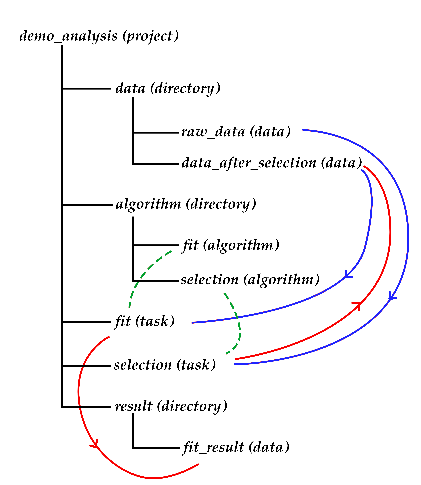

.. Chern documentation master file, created by
   sphinx-quickstart on Sat Jul 15 19:59:40 2017.
   You can adapt this file completely to your liking, but it should at least
   contain the root `toctree` directive.

Chern Documentation
===================

Welcome to Chern, a data analysis management toolkit designed for high energy physics research. 

In high energy physics data analysis, we typically process data through various programs sequentially. However, as experiments progress, we need to continuously update models and parameters. These updates often make our programs and data increasingly disorganized and difficult to manage. Chern provides a framework to help organize analysis projects and create more structured, reproducible workflows.

Design Philosophy
-----------------

.. figure:: fig/liuchengtu1.png

   Workflow of a demo analysis (made by Shunan Zhang)

Abstract Workflow
~~~~~~~~~~~~~~~~~

The concept of workflow is similar to that of most pipeline tools. A typical analysis is modeled as a workflow where data, tasks, and algorithms are represented as virtual objects called VObjects. These VObjects are linked by their relationships, and Chern manages this flow.

In the figure above, "raw data" is processed by a VTask called "task selection" to generate VData called "data after selection". The VTask "task selection" uses a VAlgorithm "algorithm selection". The VData "data after selection" is further processed by a VTask called "task fit", which uses "algorithm fit" and generates a data file called "result after fit".

The workflow elements are categorized as follows:

+ **VData**: Represents datasets, including plots and other information generated by programs. These are not actual data files but expected inputs and outputs of programs.
+ **VAlgorithm**: Contains the program code and compilation flow. Algorithms define the computational logic for processing data.
+ **VTask**: Represents the execution of an algorithm, providing required parameters and specifying input/output files.

Before running an analysis, you specify the input data, output data, parameters, and algorithms required for each task. This creates a directed acyclic graph (DAG) that can be executed in the specified order.

Physical Organization
~~~~~~~~~~~~~~~~~~~~

Abstract elements (data, algorithms, and tasks) must be organized in concrete physical locations. Rather than listing them sequentially, they should be organized logically by content classification. Chern organizes all algorithms, tasks, and data as directories, providing a hierarchical structure for navigation.

Example Structure
~~~~~~~~~~~~~~~~

For an analysis that processes data through selection1, selection2, and fit steps, the abstract nodes would be:

   Demo analysis structure (made by Shunan Zhang)

- data
- selection1_algorithm
- selection2_algorithm  
- fit_algorithm
- selection1_task
- data_after_selection1
- selection2_task
- data_after_selection2
- fit_task
- fit_result

These relationships are established before analysis begins. For example, selection1_task uses selection1_algorithm with data as input and data_after_selection1 as output.

Analysis Preservation
~~~~~~~~~~~~~~~~~~~~

For analysis preservation, Chern encourages users to maintain documentation and version control. The best approach is to integrate these practices into the daily workflow by modifying the shell environment. Chern uses IPython as the shell and modifies standard commands like `mkdir`, `mv`, `rm`, `cp` to automatically track changes and maintain documentation.

When analysis modifications are needed, they can be abstracted as adding or removing nodes from the workflow graph. During re-execution, only modified nodes and their downstream dependencies need to be re-run, ensuring efficiency and reproducibility.

Contents
--------

.. toctree::
   :maxdepth: 2

   UserGuide
   schedule
   installation

